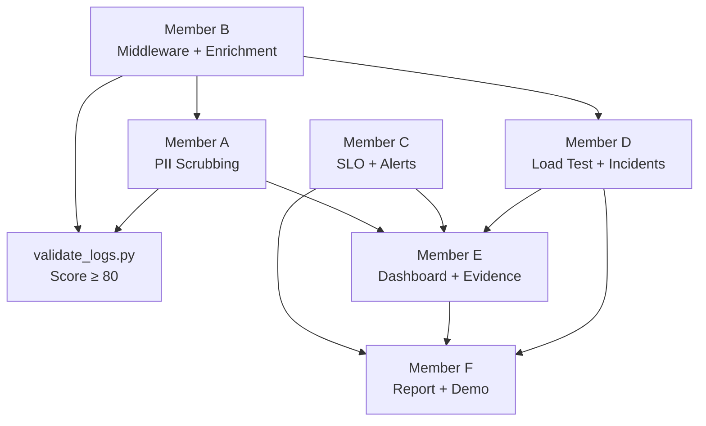

# 📋 Lab 13 — Phân Công Công Việc (6 Thành Viên)

> **Trạng thái**: `[ ]` Chưa làm · `[/]` Đang làm · `[x]` Hoàn thành
> **Mục tiêu**: Validate Score ≥ 80/100 · ≥ 10 Langfuse traces · Dashboard 6 panels

---

## 👤 Member A — Logging & PII

**Trọng tâm**: Structured logging, PII scrubbing, bảo vệ dữ liệu nhạy cảm

- [ ] **TODO 3**: Uncomment `scrub_event` trong `app/logging_config.py` (dòng 46)
  - Bỏ comment dòng `# scrub_event,` → thành `scrub_event,`
  - Đảm bảo processor nằm **sau** `TimeStamper` và **trước** `JsonlFileProcessor`
- [ ] **TODO 4**: Thêm PII patterns trong `app/pii.py` (dòng 11)
  - Thêm pattern `passport`: `r"\b[A-Z][0-9]{7,8}\b"`
  - Thêm pattern `vn_address`: `r"\b(?:số|đường|phường|quận|huyện|tỉnh|thành phố|TP\.?)\s+[\w\s,]+"`
  - Cân nhắc thêm `bank_account` (cẩn thận false positive)
- [ ] Chạy `pytest tests/test_pii.py -v` → đảm bảo PASS
- [ ] Viết thêm ít nhất 2 test cases cho PII mới trong `tests/test_pii.py`:
  - Test scrub số điện thoại VN (`0987654321`)
  - Test scrub số CCCD (12 chữ số)
  - Test scrub credit card (`4111 1111 1111 1111`)
- [ ] Kiểm tra: gửi request có PII → xem `data/logs.jsonl` → confirm PII đã bị `[REDACTED_xxx]`
- [ ] Chụp screenshot log có PII redaction → lưu vào `docs/`

**Deliverables**:
- `app/logging_config.py` — scrub_event enabled
- `app/pii.py` — thêm patterns
- `tests/test_pii.py` — thêm test cases
- Screenshot: PII redaction trong logs

---

## 👤 Member B — Tracing & Enrichment

**Trọng tâm**: Correlation ID, log enrichment, Langfuse tracing

- [ ] **TODO 1**: Implement Correlation ID trong `app/middleware.py`
  - Uncomment `clear_contextvars()`
  - Thay `correlation_id = "MISSING"` bằng logic lấy từ header hoặc generate mới:
    ```python
    correlation_id = request.headers.get("x-request-id", f"req-{uuid.uuid4().hex[:8]}")
    ```
  - Uncomment `bind_contextvars(correlation_id=correlation_id)`
  - Uncomment và hoàn thiện response headers:
    ```python
    response.headers["x-request-id"] = correlation_id
    response.headers["x-response-time-ms"] = f"{(time.perf_counter() - start) * 1000:.1f}"
    ```
- [ ] **TODO 2**: Enrich logs trong `app/main.py` (hàm `chat()`, dòng 47-48)
  - Thêm `bind_contextvars()` với: `user_id_hash`, `session_id`, `feature`, `model`, `env`
  - Dùng `hash_user_id(body.user_id)` để hash user_id
- [ ] Cấu hình Langfuse trong `.env`:
  - Đăng ký tại [cloud.langfuse.com](https://cloud.langfuse.com)
  - Tạo project → lấy `LANGFUSE_PUBLIC_KEY` và `LANGFUSE_SECRET_KEY`
  - Điền vào `.env`
- [ ] Verify: gửi request → check response header có `x-request-id` ≠ `"MISSING"`
- [ ] Verify: mở `data/logs.jsonl` → check mỗi log có `correlation_id`, `user_id_hash`, `session_id`, `feature`, `model`
- [ ] Chụp screenshot: JSON log có correlation_id + enrichment fields

**Deliverables**:
- `app/middleware.py` — Correlation ID hoàn chỉnh  
- `app/main.py` — Log enrichment
- `.env` — Langfuse keys configured
- Screenshot: Correlation ID trong logs

---

## 👤 Member C — SLO & Alerts

**Trọng tâm**: Định nghĩa SLO, alert rules, runbook

- [ ] Review và cập nhật `config/slo.yaml`:
  - Cập nhật `note` cho `latency_p95_ms` (xóa "Replace with your group's target")
  - Điều chỉnh objectives nếu cần dựa trên metrics thực tế
  - Thêm ghi chú giải thích cho từng SLI
- [ ] Review và cập nhật `config/alert_rules.yaml`:
  - Xác nhận 3 rules hiện có hợp lý
  - Cân nhắc thêm alert mới (ví dụ: `low_quality_score`, `token_spike`)
  - Đảm bảo mỗi alert có `runbook` link đúng
- [ ] Cập nhật `docs/alerts.md` (runbook):
  - Đảm bảo 3 mục runbook match với alert rules
  - Nếu thêm alert mới → thêm mục runbook tương ứng
  - Viết chi tiết "First checks" và "Mitigation" cho từng alert
- [ ] Tạo bảng SLO cho báo cáo blueprint (Section 3.2):
  | SLI | Target | Window | Current Value |
  |---|---|---|---|
  | Latency P95 | < 3000ms | 28d | ??? |
  | Error Rate | < 2% | 28d | ??? |
  | Cost Budget | < $2.5/day | 1d | ??? |
  | Quality Avg | > 0.75 | 28d | ??? |
- [ ] Chụp screenshot alert rules → lưu vào `docs/`

**Deliverables**:
- `config/slo.yaml` — SLO cập nhật
- `config/alert_rules.yaml` — Alert rules hoàn chỉnh (≥ 3 rules)
- `docs/alerts.md` — Runbook đầy đủ
- Bảng SLO với Current Value (sau khi có metrics)

---

## 👤 Member D — Load Test & Incident Injection

**Trọng tâm**: Tạo traffic, inject incidents, thu thập dữ liệu cho dashboard

- [ ] Chạy app: `uvicorn app.main:app --reload`
- [ ] Gửi requests cơ bản: `python scripts/load_test.py`
- [ ] Gửi requests concurrent: `python scripts/load_test.py --concurrency 5`
- [ ] Verify traces trên Langfuse: đảm bảo ≥ 10 traces → chụp screenshot
- [ ] **Inject incident `rag_slow`**:
  - `python scripts/inject_incident.py --scenario rag_slow`
  - Gửi 5-10 requests → ghi nhận latency_p95 nhảy vọt
  - Ghi lại metrics trước/sau từ `GET /metrics`
  - Tắt: `python scripts/inject_incident.py --scenario rag_slow --disable`
- [ ] **Inject incident `tool_fail`**:
  - `python scripts/inject_incident.py --scenario tool_fail`
  - Gửi requests → ghi nhận errors tăng
  - Ghi lại error_breakdown từ `/metrics`
  - Tắt: `python scripts/inject_incident.py --scenario tool_fail --disable`
- [ ] **Inject incident `cost_spike`**:
  - `python scripts/inject_incident.py --scenario cost_spike`
  - Gửi requests → ghi nhận cost/tokens tăng
  - Ghi lại total_cost_usd, tokens trước/sau
  - Tắt: `python scripts/inject_incident.py --scenario cost_spike --disable`
- [ ] Thu thập dữ liệu metrics qua nhiều lần test → giao cho Member E làm dashboard
- [ ] Chụp screenshot Langfuse trace list (≥ 10 traces) + trace waterfall

**Deliverables**:
- Dữ liệu metrics nhiều lần (bình thường + 3 incidents)
- Screenshot: Langfuse ≥ 10 traces
- Screenshot: Trace waterfall chi tiết
- Screenshot: Incident before/after (bonus)

---

## 👤 Member E — Dashboard & Evidence

**Trọng tâm**: Xây dashboard 6 panels, thu thập evidence, chụp screenshots

- [ ] Xây dashboard 6 panels (dùng HTML+Chart.js hoặc tool khác):
  - Panel 1: **Latency P50/P95/P99** (line chart, đơn vị ms)
  - Panel 2: **Traffic** (request count, bar chart)
  - Panel 3: **Error Rate** với breakdown (pie/stacked bar, đơn vị %)
  - Panel 4: **Cost Over Time** (line chart, đơn vị USD)
  - Panel 5: **Tokens In/Out** (stacked bar, đơn vị count)
  - Panel 6: **Quality Score** (gauge/line, đơn vị 0-1)
- [ ] Dashboard requirements:
  - Default time range = 1 giờ
  - Auto refresh mỗi 15-30 giây (fetch `/metrics`)
  - Có SLO line/threshold trên mỗi chart
  - Đơn vị rõ ràng trên trục
  - Tối đa 6-8 panels
- [ ] Chụp screenshot dashboard đầy đủ 6 panels
- [ ] Thu thập tất cả screenshots cho `docs/grading-evidence.md`:
  - [ ] Langfuse trace list ≥ 10 traces (từ Member D)
  - [ ] Trace waterfall chi tiết (từ Member D)
  - [ ] JSON logs có correlation_id (từ Member B)
  - [ ] Log với PII redaction (từ Member A)
  - [ ] Dashboard 6 panels (tự làm)
  - [ ] Alert rules với runbook link (từ Member C)
- [ ] Lưu tất cả screenshots vào `docs/screenshots/` hoặc tương tự

**Deliverables**:
- Dashboard file (HTML/link)
- Screenshot: Dashboard 6 panels
- Tất cả screenshots evidence tập hợp đầy đủ

---

## 👤 Member F — Blueprint Report & Demo Lead

**Trọng tâm**: Viết báo cáo, chuẩn bị demo, tổng hợp kết quả nhóm

- [ ] Điền `docs/blueprint-template.md`:
  - [ ] **Section 1 — Team Metadata**: Tên nhóm, repo URL, danh sách thành viên + vai trò
  - [ ] **Section 2 — Group Performance**: 
    - Chạy `python scripts/validate_logs.py` → ghi điểm
    - Đếm traces trên Langfuse → ghi số
    - Confirm PII leaks = 0
  - [ ] **Section 3 — Technical Evidence**:
    - 3.1 Logging & Tracing: điền screenshots correlation ID, PII redaction, trace waterfall + giải thích
    - 3.2 Dashboard & SLOs: điền screenshot dashboard, bảng SLO (lấy từ Member C)
    - 3.3 Alerts & Runbook: điền screenshot alerts, link runbook
  - [ ] **Section 4 — Incident Response**: 
    - Chọn 1 scenario (rag_slow recommended)
    - Ghi symptoms, root cause, fix, preventive measure
  - [ ] **Section 5 — Individual Contributions**: Thu thập từ mỗi member
    - Mỗi người ghi tasks completed + link commit/PR
  - [ ] **Section 6 — Bonus Items** (nếu có)
- [ ] Chuẩn bị demo script:
  - Thứ tự demo: Health check → Gửi request → Show logs → Show Langfuse → Show dashboard → Inject incident → Debug flow
  - Phân công ai demo phần nào
  - Chuẩn bị trả lời câu hỏi giảng viên (xem `docs/mock-debug-qa.md` nếu có)
- [ ] Review lần cuối: chạy `validate_logs.py` → confirm ≥ 80/100
- [ ] Commit & push tất cả changes lên Git

**Deliverables**:
- `docs/blueprint-template.md` — hoàn chỉnh
- Demo script/outline
- Final validation pass

---

## 📅 Thứ Tự Thực Hiện (Timeline Gợi Ý)

```
Giờ 1 (Setup & Core TODOs):
├── ALL: Setup env, pip install, copy .env
├── Member B: Fix middleware.py (TODO 1) + main.py (TODO 2)  ← ƯU TIÊN CAO
├── Member A: Fix logging_config.py (TODO 3) + pii.py (TODO 4)  ← ƯU TIÊN CAO
└── Member B: Cấu hình Langfuse keys

Giờ 2 (Validate & Data Collection):
├── Member D: Chạy load_test.py, verify traces, inject incidents
├── Member A: Chạy validate_logs.py, fix nếu chưa đạt 100
├── Member C: Cập nhật SLO + alert rules + runbook
└── Member B: Verify Langfuse traces, chụp screenshots

Giờ 3 (Dashboard & Report):
├── Member E: Xây dashboard 6 panels
├── Member D: Thu thập thêm data, inject thêm incidents
├── Member C: Hoàn thiện bảng SLO với current values
└── Member F: Bắt đầu viết blueprint report

Giờ 4 (Polish & Demo):
├── Member E: Thu thập tất cả screenshots
├── Member F: Hoàn thiện report, chuẩn bị demo
├── ALL: Review, commit, push
└── ALL: Rehearse demo
```

---

## ⚡ Phụ Thuộc Giữa Các Members



> [!IMPORTANT]
> **Member B phải hoàn thành TODO 1 & 2 trước** vì tất cả members khác phụ thuộc vào correlation ID và log enrichment hoạt động đúng.
> 
> **Member A nên hoàn thành song song** với Member B vì PII scrubbing độc lập.
> 
> **Member D bắt đầu ngay khi B + A xong** để tạo data cho E và F.
