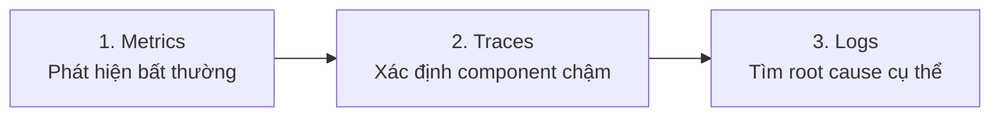

# 🔭 Lab 13 — Observability Lab: Walkthrough Chi Tiết

> **Chủ đề**: Monitoring, Logging, và Observability cho một FastAPI "agent"
> **Thời gian dự kiến**: ~4 giờ
> **Mô hình chấm điểm**: 60% Nhóm + 40% Cá nhân

---

## 📋 Mục Lục

1. [Tổng Quan Dự Án](#1-tổng-quan-dự-án)
2. [Cấu Trúc Repo](#2-cấu-trúc-repo)
3. [Setup Môi Trường](#3-setup-môi-trường)
4. [Danh Sách TODO Cần Hoàn Thành](#4-danh-sách-todo-cần-hoàn-thành)
   - [TODO 1: Correlation ID Middleware](#todo-1-correlation-id-middleware)
   - [TODO 2: Enrich Logs với Request Context](#todo-2-enrich-logs-với-request-context)
   - [TODO 3: PII Scrubbing Processor](#todo-3-pii-scrubbing-processor)
   - [TODO 4: Thêm PII Patterns](#todo-4-thêm-pii-patterns)
5. [Langfuse Tracing](#5-langfuse-tracing)
6. [Dashboard 6 Panels](#6-dashboard-6-panels)
7. [Alert Rules & Runbook](#7-alert-rules--runbook)
8. [Incident Response & Debugging](#8-incident-response--debugging)
9. [Chạy Validation & Tests](#9-chạy-validation--tests)
10. [Viết Báo Cáo Blueprint](#10-viết-báo-cáo-blueprint)
11. [Grading Evidence](#11-grading-evidence)
12. [Checklist Hoàn Thành](#12-checklist-hoàn-thành)

---

## 1. Tổng Quan Dự Án

Lab 13 yêu cầu bạn **instrument** (trang bị công cụ quan sát) cho một ứng dụng FastAPI agent đã có sẵn. Cụ thể:

| Thành phần | Mô tả |
|---|---|
| **Structured JSON Logging** | Log ra file JSONL với schema chuẩn |
| **Correlation ID** | Mỗi request có ID duy nhất, xuyên suốt từ request → log → response |
| **PII Scrubbing** | Tự động che giấu thông tin nhạy cảm (email, SĐT, CCCD, thẻ tín dụng) |
| **Langfuse Tracing** | Gửi traces lên Langfuse để theo dõi luồng xử lý agent |
| **Metrics** | Thu thập latency, cost, tokens, quality, errors |
| **Dashboard** | Xây 6 panel dashboard từ metrics |
| **SLOs & Alerts** | Định nghĩa Service Level Objectives và alert rules |
| **Incident Response** | Inject lỗi giả lập, phân tích root cause |

> [!IMPORTANT]
> Template này **cố ý chưa hoàn chỉnh**. Bạn phải hoàn thành tất cả `TODO` trong code để đạt điểm.

---

## 2. Cấu Trúc Repo

```
Team-C2-lab13/
├── app/                          # ⭐ Source code chính
│   ├── main.py                   # FastAPI app — TODO: enrich logs
│   ├── middleware.py             # Correlation ID — TODO: implement
│   ├── logging_config.py        # structlog config — TODO: register PII scrubber
│   ├── pii.py                   # PII scrubbing — TODO: thêm patterns
│   ├── agent.py                 # Core agent pipeline (đã có sẵn)
│   ├── tracing.py               # Langfuse helpers (đã có sẵn)
│   ├── metrics.py               # In-memory metrics (đã có sẵn)
│   ├── schemas.py               # Pydantic models (đã có sẵn)
│   ├── incidents.py             # Toggle incident injection (đã có sẵn)
│   ├── mock_llm.py              # Fake LLM (đã có sẵn)
│   └── mock_rag.py              # Fake retrieval (đã có sẵn)
├── config/
│   ├── slo.yaml                 # ⭐ SLO definitions — cần review/update
│   ├── alert_rules.yaml         # ⭐ Alert rules — cần review/update
│   └── logging_schema.json      # Expected log schema (tham khảo)
├── scripts/
│   ├── load_test.py             # Generate test requests
│   ├── inject_incident.py       # Bật/tắt incident scenarios
│   └── validate_logs.py         # ⭐ Kiểm tra kết quả — CHẠY ĐỂ XEM ĐIỂM
├── data/
│   ├── sample_queries.jsonl     # 10 test queries (có PII giả lập)
│   ├── expected_answers.jsonl   # Quality checks
│   └── incidents.json           # Mô tả các scenarios
├── docs/
│   ├── blueprint-template.md    # ⭐ BÁO CÁO NHÓM — cần điền
│   ├── alerts.md                # Runbook cho alerts
│   ├── dashboard-spec.md        # Spec cho 6-panel dashboard
│   └── grading-evidence.md      # Danh sách screenshots cần chụp
├── tests/
│   ├── test_pii.py              # Unit test cho PII
│   └── test_metrics.py          # Unit test cho metrics
├── .env.example                 # Template biến môi trường
├── requirements.txt             # Dependencies
└── README.md                    # Hướng dẫn chung
```

---

## 3. Setup Môi Trường

### Bước 3.1 — Tạo virtual environment và cài dependencies

```bash
cd Team-C2-lab13
python -m venv .venv

# Windows:
.venv\Scripts\activate

# Linux/Mac:
# source .venv/bin/activate

pip install -r requirements.txt
```

### Bước 3.2 — Tạo file `.env`

```bash
copy .env.example .env
```

Nội dung file `.env`:
```env
APP_ENV=dev
APP_NAME=day13-observability-lab
LOG_LEVEL=INFO
LOG_PATH=data/logs.jsonl
AUDIT_LOG_PATH=data/audit.jsonl
LANGFUSE_PUBLIC_KEY=pk-lf-xxxxxxxx          # Lấy từ Langfuse dashboard
LANGFUSE_SECRET_KEY=sk-lf-xxxxxxxx          # Lấy từ Langfuse dashboard
LANGFUSE_HOST=https://cloud.langfuse.com
```

> [!NOTE]
> Nếu chưa có Langfuse account → Đăng ký miễn phí tại [cloud.langfuse.com](https://cloud.langfuse.com). Tạo project → lấy Public Key và Secret Key từ Settings.

### Bước 3.3 — Chạy thử app (trước khi sửa)

```bash
uvicorn app.main:app --reload
```

Thử gửi request:
```bash
curl -X POST http://127.0.0.1:8000/chat -H "Content-Type: application/json" -d "{\"user_id\":\"u01\",\"session_id\":\"s01\",\"feature\":\"qa\",\"message\":\"Hello\"}"
```

> Bạn sẽ thấy `correlation_id` trả về là `"MISSING"` → đây là vấn đề cần fix đầu tiên.

---

## 4. Danh Sách TODO Cần Hoàn Thành

### TODO 1: Correlation ID Middleware

📄 **File**: [middleware.py](file:///c:/Users/speed/OneDrive/Desktop/Team-C2-lab13/app/middleware.py)

**Vấn đề**: Hiện tại `correlation_id` luôn là `"MISSING"`, contextvars không được clear/bind, response headers không có request-id.

**Cần làm** — Sửa class `CorrelationIdMiddleware`:

```python
class CorrelationIdMiddleware(BaseHTTPMiddleware):
    async def dispatch(self, request: Request, call_next):
        # 1. Clear contextvars để tránh leak giữa các request
        clear_contextvars()

        # 2. Lấy x-request-id từ header, nếu không có thì generate mới
        #    Format: req-<8 ký tự hex>
        correlation_id = request.headers.get(
            "x-request-id",
            f"req-{uuid.uuid4().hex[:8]}"
        )

        # 3. Bind correlation_id vào structlog contextvars
        #    → Tất cả log trong request này sẽ tự động có field correlation_id
        bind_contextvars(correlation_id=correlation_id)

        # 4. Lưu vào request.state để endpoint có thể truy cập
        request.state.correlation_id = correlation_id

        # 5. Đo thời gian xử lý
        start = time.perf_counter()
        response = await call_next(request)
        elapsed_ms = (time.perf_counter() - start) * 1000

        # 6. Thêm correlation_id và thời gian xử lý vào response headers
        response.headers["x-request-id"] = correlation_id
        response.headers["x-response-time-ms"] = f"{elapsed_ms:.1f}"

        return response
```

**Giải thích logic**:
- `clear_contextvars()` → Mỗi request bắt đầu sạch, không bị "nhiễm" context từ request trước
- `uuid.uuid4().hex[:8]` → Tạo ID ngắn gọn (`req-a1b2c3d4`) dễ tìm trong logs
- `bind_contextvars(correlation_id=...)` → structlog tự thêm field `correlation_id` vào **mọi** log message trong request
- Response headers → Client nhận được `x-request-id` để đối chiếu nếu cần debug

---

### TODO 2: Enrich Logs với Request Context

📄 **File**: [main.py](file:///c:/Users/speed/OneDrive/Desktop/Team-C2-lab13/app/main.py) — hàm `chat()` (dòng 46-48)

**Vấn đề**: Logs hiện tại thiếu các field context như `user_id_hash`, `session_id`, `feature`, `model`, `env`. Script `validate_logs.py` sẽ trừ 20 điểm nếu thiếu.

**Cần làm** — Thêm `bind_contextvars()` ngay đầu hàm `chat()`:

```python
@app.post("/chat", response_model=ChatResponse)
async def chat(request: Request, body: ChatRequest) -> ChatResponse:
    # Bind context vào structlog → mọi log trong request này đều có các field này
    bind_contextvars(
        user_id_hash=hash_user_id(body.user_id),   # Hash user_id, KHÔNG log plaintext
        session_id=body.session_id,
        feature=body.feature,
        model="claude-sonnet-4-5",                      # Model name cho tracing
        env=os.getenv("APP_ENV", "dev"),
    )

    log.info(
        "request_received",
        service="api",
        payload={"message_preview": summarize_text(body.message)},
    )
    # ... phần còn lại giữ nguyên ...
```

**Giải thích**:
- `hash_user_id(body.user_id)` → Hash SHA-256 user_id thành chuỗi 12 ký tự, bảo vệ PII
- Các field `session_id`, `feature`, `model`, `env` giúp **filter và group** logs khi debug
- Nhờ `bind_contextvars`, cả 3 log messages (`request_received`, `response_sent`, `request_failed`) đều tự động kèm các field này

> [!TIP]
> Schema chuẩn yêu cầu các field: `ts`, `level`, `service`, `event`, `correlation_id`, `user_id_hash`, `session_id`, `feature`, `model`. Xem chi tiết tại [logging_schema.json](file:///c:/Users/speed/OneDrive/Desktop/Team-C2-lab13/config/logging_schema.json).

---

### TODO 3: PII Scrubbing Processor

📄 **File**: [logging_config.py](file:///c:/Users/speed/OneDrive/Desktop/Team-C2-lab13/app/logging_config.py) — hàm `configure_logging()` (dòng 45-46)

**Vấn đề**: Processor `scrub_event` đã được viết (dòng 26-34) nhưng bị **comment out** trong pipeline. Logs sẽ chứa PII (email, SĐT) → mất 30 điểm.

**Cần làm** — Uncomment `scrub_event` trong danh sách processors:

```python
def configure_logging() -> None:
    logging.basicConfig(format="%(message)s", level=getattr(logging, os.getenv("LOG_LEVEL", "INFO")))
    structlog.configure(
        processors=[
            merge_contextvars,
            structlog.processors.add_log_level,
            structlog.processors.TimeStamper(fmt="iso", utc=True, key="ts"),
            scrub_event,                              # ← BỎ COMMENT DÒNG NÀY
            structlog.processors.StackInfoRenderer(),
            structlog.processors.format_exc_info,
            JsonlFileProcessor(),
            structlog.processors.JSONRenderer(),
        ],
        wrapper_class=structlog.make_filtering_bound_logger(logging.INFO),
        cache_logger_on_first_use=True,
    )
```

**Giải thích**:
- `scrub_event` là một structlog processor chạy **trước** khi log được ghi ra file
- Nó quét tất cả string trong `payload` dict và `event` field, thay thế PII bằng `[REDACTED_xxx]`
- Thứ tự processor quan trọng: `scrub_event` phải nằm **sau** `TimeStamper` (để không scrub timestamp) và **trước** `JsonlFileProcessor` (để file log đã sạch PII)

---

### TODO 4: Thêm PII Patterns

📄 **File**: [pii.py](file:///c:/Users/speed/OneDrive/Desktop/Team-C2-lab13/app/pii.py) — dòng 11

**Vấn đề**: Hiện chỉ có 4 patterns (email, phone_vn, cccd, credit_card). Rubric yêu cầu "PII redact hoàn toàn" và gợi ý thêm Passport, Vietnamese address keywords.

**Cần làm** — Thêm patterns vào dict `PII_PATTERNS`:

```python
PII_PATTERNS: dict[str, str] = {
    "email": r"[\w\.-]+@[\w\.-]+\.\w+",
    "phone_vn": r"(?:\+84|0)[ \.-]?\d{3}[ \.-]?\d{3}[ \.-]?\d{3,4}",
    "cccd": r"\b\d{12}\b",
    "credit_card": r"\b\d{4}[- ]?\d{4}[- ]?\d{4}[- ]?\d{4}\b",
    # === THÊM CÁC PATTERNS MỚI ===
    "passport": r"\b[A-Z][0-9]{7,8}\b",                          # Passport VN: B12345678
    "bank_account": r"\b\d{10,19}\b",                             # Số tài khoản ngân hàng (cẩn thận false positive)
    "vn_address": r"\b(?:số|đường|phường|quận|huyện|tỉnh|thành phố|TP\.?)\s+[\w\s,]+",  # Địa chỉ VN
}
```

> [!WARNING]
> Pattern `bank_account` (`\b\d{10,19}\b`) có thể gây **false positive** (nhầm số bình thường là số tài khoản). Trong production, nên dùng thư viện chuyên dụng hoặc NER model. Với lab này, đơn giản là OK.

**Chạy test để kiểm tra**:
```bash
pytest tests/test_pii.py -v
```

---

## 5. Langfuse Tracing

### 5.1 — Cấu hình Langfuse

1. Đăng ký tại [cloud.langfuse.com](https://cloud.langfuse.com)
2. Tạo project mới (ví dụ: `day13-observability`)
3. Vào **Settings** → **API Keys** → Copy `Public Key` và `Secret Key`
4. Điền vào file `.env`:

```env
LANGFUSE_PUBLIC_KEY=pk-lf-xxxxxxxx
LANGFUSE_SECRET_KEY=sk-lf-xxxxxxxx
LANGFUSE_HOST=https://cloud.langfuse.com
```

### 5.2 — Code tracing đã có sẵn

Code tracing trong [agent.py](file:///c:/Users/speed/OneDrive/Desktop/Team-C2-lab13/app/agent.py) **đã được implement**:

- Dòng 28: `@observe()` decorator trên `LabAgent.run()` → tự tạo trace
- Dòng 38-46: `langfuse_context.update_current_trace(...)` và `update_current_observation(...)` → thêm metadata

Bạn **không cần sửa gì** ở file `agent.py` hay `tracing.py`, chỉ cần cấu hình đúng keys.

### 5.3 — Tạo ít nhất 10 traces

```bash
# Đảm bảo app đang chạy
uvicorn app.main:app --reload

# Gửi 10 requests từ sample_queries.jsonl
python scripts/load_test.py

# Hoặc gửi nhiều hơn với concurrency
python scripts/load_test.py --concurrency 3
```

> [!IMPORTANT]
> Yêu cầu tối thiểu: **10 traces** trên Langfuse. Kiểm tra tại Langfuse dashboard → **Traces** tab.

### 5.4 — Verify trên Langfuse

Sau khi gửi requests, vào Langfuse dashboard kiểm tra:
- Traces đã xuất hiện (mỗi request = 1 trace)
- Mỗi trace có `user_id` (đã hash), `session_id`, `tags`
- Metadata có `doc_count`, `query_preview`
- Usage details có `input` và `output` tokens

**Chụp screenshots** (cần cho báo cáo):
1. Danh sách traces >= 10 traces
2. Một trace waterfall chi tiết

---

## 6. Dashboard 6 Panels

📄 **Spec**: [dashboard-spec.md](file:///c:/Users/speed/OneDrive/Desktop/Team-C2-lab13/docs/dashboard-spec.md)

Bạn cần xây **6 panels** dashboard. Dữ liệu lấy từ endpoint `GET /metrics`:

```bash
curl http://127.0.0.1:8000/metrics
```

Response mẫu:
```json
{
  "traffic": 10,
  "latency_p50": 165.0,
  "latency_p95": 180.0,
  "latency_p99": 185.0,
  "avg_cost_usd": 0.0012,
  "total_cost_usd": 0.012,
  "tokens_in_total": 450,
  "tokens_out_total": 1350,
  "error_breakdown": {},
  "quality_avg": 0.82
}
```

### 6 panels bắt buộc:

| # | Panel | Metric Source | Loại biểu đồ |
|---|---|---|---|
| 1 | **Latency P50/P95/P99** | `latency_p50`, `latency_p95`, `latency_p99` | Line chart (ms) |
| 2 | **Traffic** | `traffic` | Counter / Bar chart |
| 3 | **Error Rate** | `error_breakdown` | Pie chart / Stacked bar |
| 4 | **Cost Over Time** | `total_cost_usd`, `avg_cost_usd` | Line chart ($) |
| 5 | **Tokens In/Out** | `tokens_in_total`, `tokens_out_total` | Stacked bar |
| 6 | **Quality Score** | `quality_avg` | Gauge / Line chart |

### Cách xây dashboard

Bạn có thể dùng một trong các cách sau:

**Cách 1: Tạo HTML dashboard đơn giản** (fetch `/metrics` và render bằng Chart.js)

```html
<!-- Tạo file dashboard.html trong thư mục gốc -->
<script src="https://cdn.jsdelivr.net/npm/chart.js"></script>
<script>
  async function fetchMetrics() {
    const res = await fetch('http://127.0.0.1:8000/metrics');
    return res.json();
  }
  // Render 6 panels từ data...
</script>
```

**Cách 2: Dùng Langfuse Dashboard** (nếu tích hợp đầy đủ)

**Cách 3: Export metrics ra CSV + vẽ bằng Google Sheets / Excel**

### Yêu cầu chất lượng dashboard:

- ✅ Default time range = 1 giờ
- ✅ Auto refresh mỗi 15-30 giây
- ✅ Có threshold/SLO line (ví dụ: vẽ đường SLO P95 < 3000ms)
- ✅ Đơn vị rõ ràng (ms, USD, count, %)
- ✅ Tối đa 6-8 panels

---

## 7. Alert Rules & Runbook

### 7.1 — Alert Rules

📄 **File**: [alert_rules.yaml](file:///c:/Users/speed/OneDrive/Desktop/Team-C2-lab13/config/alert_rules.yaml)

File đã có **3 alert rules** sẵn. Bạn cần **review và tùy chỉnh** cho phù hợp:

```yaml
alerts:
  - name: high_latency_p95
    severity: P2
    condition: latency_p95_ms > 5000 for 30m    # ← Có thể giảm threshold nếu muốn nhạy hơn
    type: symptom-based
    owner: team-oncall
    runbook: docs/alerts.md#1-high-latency-p95

  - name: high_error_rate
    severity: P1
    condition: error_rate_pct > 5 for 5m
    type: symptom-based
    owner: team-oncall
    runbook: docs/alerts.md#2-high-error-rate

  - name: cost_budget_spike
    severity: P2
    condition: hourly_cost_usd > 2x_baseline for 15m
    type: symptom-based
    owner: finops-owner
    runbook: docs/alerts.md#3-cost-budget-spike
```

> [!TIP]
> Rubric yêu cầu **ít nhất 3 alert rules** với **runbook link hoạt động**. File đã có đủ 3, nhưng bạn có thể thêm alert cho quality score thấp, token spike, v.v. để lấy điểm bonus.

### 7.2 — SLO Definitions

📄 **File**: [slo.yaml](file:///c:/Users/speed/OneDrive/Desktop/Team-C2-lab13/config/slo.yaml)

```yaml
service: day13-observability-lab
window: 28d
slis:
  latency_p95_ms:
    objective: 3000        # ← P95 latency phải < 3000ms
    target: 99.5           # ← 99.5% thời gian phải đạt
    note: Replace with your group's target  # ← SỬA NOTE NÀY
  error_rate_pct:
    objective: 2           # ← Error rate < 2%
    target: 99.0
  daily_cost_usd:
    objective: 2.5         # ← Chi phí < $2.5/ngày
    target: 100.0
  quality_score_avg:
    objective: 0.75        # ← Quality score trung bình > 0.75
    target: 95.0
```

**Cần làm**: Cập nhật `note` và điều chỉnh các giá trị `objective`/`target` cho phù hợp với kết quả thực tế.

### 7.3 — Runbook

📄 **File**: [alerts.md](file:///c:/Users/speed/OneDrive/Desktop/Team-C2-lab13/docs/alerts.md)

File runbook đã viết sẵn 3 mục cho 3 alerts. Mỗi mục có:
- **Severity** & **Trigger condition**
- **Impact** (ảnh hưởng)
- **First checks** (đầu tiên kiểm tra gì)
- **Mitigation** (cách xử lý)

→ Bạn chỉ cần **đọc hiểu** để giải thích khi demo.

---

## 8. Incident Response & Debugging

### 8.1 — Inject Incident

Lab cung cấp 3 scenario giả lập sự cố:

| Scenario | Hiệu ứng | Cách phát hiện |
|---|---|---|
| `rag_slow` | RAG retrieval chậm 2.5s | Latency P95 tăng vọt, trace thấy span RAG lâu |
| `tool_fail` | Vector store ném RuntimeError | Error rate tăng, log có `error_type: RuntimeError` |
| `cost_spike` | Output tokens x4 | Cost tăng, tokens_out bất thường |

**Bật incident**:
```bash
python scripts/inject_incident.py --scenario rag_slow
```

**Tắt incident**:
```bash
python scripts/inject_incident.py --scenario rag_slow --disable
```

### 8.2 — Quy trình Debug (Metrics → Traces → Logs)

Đây là flow mà giảng viên sẽ hỏi khi demo:



**Ví dụ với `rag_slow`**:

1. **Metrics**: Gọi `GET /metrics` → thấy `latency_p95` nhảy từ ~170ms lên >2500ms
2. **Traces**: Vào Langfuse → mở trace chậm → thấy span `retrieve()` mất ~2.5s (bình thường ~1ms)
3. **Logs**: Grep logs → thấy request nào có latency_ms > 2500 → xác nhận RAG slow

### 8.3 — Viết Incident Report

Trong [blueprint-template.md](file:///c:/Users/speed/OneDrive/Desktop/Team-C2-lab13/docs/blueprint-template.md) phần `## 4. Incident Response`:

```markdown
## 4. Incident Response (Group)
- [SCENARIO_NAME]: rag_slow
- [SYMPTOMS_OBSERVED]: Latency P95 tăng từ ~170ms lên >2500ms sau khi bật incident
- [ROOT_CAUSE_PROVED_BY]: Trace ID req-xxxx cho thấy span retrieve() mất 2503ms
- [FIX_ACTION]: Tắt incident toggle rag_slow, confirm latency trở về bình thường
- [PREVENTIVE_MEASURE]: Thêm timeout cho RAG retrieval (max 1s), fallback khi quá chậm
```

---

## 9. Chạy Validation & Tests

### 9.1 — Validate Logs (Quan trọng nhất!)

```bash
# Đảm bảo đã gửi ít nhất vài requests trước
python scripts/validate_logs.py
```

Kết quả mong đợi (100/100):
```
--- Lab Verification Results ---
Total log records analyzed: 30
Records with missing required fields: 0
Records with missing enrichment (context): 0
Unique correlation IDs found: 10
Potential PII leaks detected: 0

--- Grading Scorecard (Estimates) ---
+ [PASSED] Basic JSON schema
+ [PASSED] Correlation ID propagation
+ [PASSED] Log enrichment
+ [PASSED] PII scrubbing

Estimated Score: 100/100
```

**Bảng trừ điểm nếu FAIL**:

| Check | Penalty | Nguyên nhân thường gặp |
|---|---:|---|
| Missing required fields | -30 | Chưa có `ts`, `level`, hoặc `event` |
| Correlation ID | -20 | ID vẫn là `"MISSING"` (chưa fix middleware) |
| Log enrichment | -20 | Chưa `bind_contextvars` trong `chat()` |
| PII scrubbing | -30 | Chưa uncomment `scrub_event` hoặc log vẫn chứa `@` |

### 9.2 — Chạy Unit Tests

```bash
pytest tests/ -v
```

### 9.3 — Xóa log cũ và chạy lại (nếu cần)

```bash
# Xóa log cũ (có thể chứa log từ trước khi fix)
del data\logs.jsonl

# Restart app
uvicorn app.main:app --reload

# Gửi lại requests
python scripts/load_test.py

# Validate lại
python scripts/validate_logs.py
```

> [!CAUTION]
> File `data/logs.jsonl` tích lũy tất cả log, kể cả log từ trước khi fix TODO. Nếu validate bị fail vì PII leaks, hãy **xóa file log cũ** và chạy lại từ đầu.

---

## 10. Viết Báo Cáo Blueprint

📄 **File**: [blueprint-template.md](file:///c:/Users/speed/OneDrive/Desktop/Team-C2-lab13/docs/blueprint-template.md)

Điền tất cả các mục trong template. Ví dụ:

### Phần 1 — Team Metadata
```markdown
- [GROUP_NAME]: Team-C2
- [REPO_URL]: https://github.com/your-org/Team-C2-lab13
- [MEMBERS]:
  - Member A: Nguyễn Văn A | Role: Logging & PII
  - Member B: Trần Thị B | Role: Tracing & Enrichment
  - ...
```

### Phần 2 — Group Performance
```markdown
- [VALIDATE_LOGS_FINAL_SCORE]: 100/100
- [TOTAL_TRACES_COUNT]: 15
- [PII_LEAKS_FOUND]: 0
```

### Phần 3 — Technical Evidence
Chụp screenshots và điền đường dẫn:
- Correlation ID trong JSON logs
- PII redaction (`[REDACTED_EMAIL]`, `[REDACTED_PHONE_VN]`)
- Langfuse trace waterfall
- Dashboard 6 panels
- Alert rules

### Phần 5 — Individual Contributions
Mỗi thành viên ghi rõ:
- Phần việc đã làm
- Link commit/PR cụ thể

---

## 11. Grading Evidence

📄 **Checklist screenshots**: [grading-evidence.md](file:///c:/Users/speed/OneDrive/Desktop/Team-C2-lab13/docs/grading-evidence.md)

### Screenshots BẮT BUỘC:
1. ✅ Langfuse trace list (>= 10 traces)
2. ✅ Một trace waterfall chi tiết
3. ✅ JSON logs có `correlation_id` (không phải "MISSING")
4. ✅ Log line có PII đã redacted
5. ✅ Dashboard 6 panels
6. ✅ Alert rules với runbook link

### Screenshots TÙY CHỌN (bonus):
- Incident before/after fix
- Cost comparison trước/sau optimization
- Auto-instrumentation proof

---

## 12. Checklist Hoàn Thành

Dùng checklist này để tự đánh giá trước khi nộp:

### Code (TODO)
- [ ] `middleware.py` — Correlation ID: clear contextvars, generate/extract ID, bind contextvars, response headers
- [ ] `main.py` — Enrich logs: `bind_contextvars()` với user_id_hash, session_id, feature, model, env
- [ ] `logging_config.py` — Uncomment `scrub_event` processor
- [ ] `pii.py` — Thêm PII patterns (passport, address, ...)

### Langfuse
- [ ] Cấu hình LANGFUSE keys trong `.env`
- [ ] Có >= 10 traces trên Langfuse dashboard
- [ ] Traces có đủ metadata (user_id, session_id, tags, usage)

### Dashboard
- [ ] 6 panels: Latency, Traffic, Error Rate, Cost, Tokens, Quality
- [ ] Có SLO line/threshold
- [ ] Đơn vị rõ ràng
- [ ] Screenshot đã chụp

### Alerts & SLO
- [ ] 3+ alert rules trong `alert_rules.yaml`
- [ ] Runbook links hoạt động (`docs/alerts.md#...`)
- [ ] SLO values đã cập nhật trong `slo.yaml`

### Incident Response
- [ ] Đã inject ít nhất 1 incident (rag_slow / tool_fail / cost_spike)
- [ ] Đã phân tích root cause theo flow: Metrics → Traces → Logs
- [ ] Đã viết incident report trong blueprint

### Validation
- [ ] `validate_logs.py` đạt >= 80/100 (yêu cầu tối thiểu)
- [ ] Mục tiêu: 100/100
- [ ] Unit tests pass (`pytest tests/ -v`)

### Báo cáo
- [ ] `blueprint-template.md` điền đầy đủ
- [ ] Screenshots trong `docs/` hoặc link
- [ ] Individual contributions có commit evidence

### Bonus (tùy chọn, +10đ)
- [ ] +3đ: Tối ưu chi phí (số liệu trước/sau)
- [ ] +3đ: Dashboard đẹp, chuyên nghiệp
- [ ] +2đ: Auto-instrumentation / custom scripts
- [ ] +2đ: Audit logs tách riêng (`data/audit.jsonl`)

---

## Phụ Lục: Lệnh Tham Khảo Nhanh

```bash
# Setup
python -m venv .venv && .venv\Scripts\activate
pip install -r requirements.txt
copy .env.example .env

# Chạy app
uvicorn app.main:app --reload

# Gửi test requests
python scripts/load_test.py
python scripts/load_test.py --concurrency 5

# Inject incidents
python scripts/inject_incident.py --scenario rag_slow
python scripts/inject_incident.py --scenario tool_fail
python scripts/inject_incident.py --scenario cost_spike
python scripts/inject_incident.py --scenario rag_slow --disable

# Validate
python scripts/validate_logs.py

# Tests
pytest tests/ -v

# Check health & metrics
curl http://127.0.0.1:8000/health
curl http://127.0.0.1:8000/metrics

# Xóa log cũ nếu cần
del data\logs.jsonl
```
